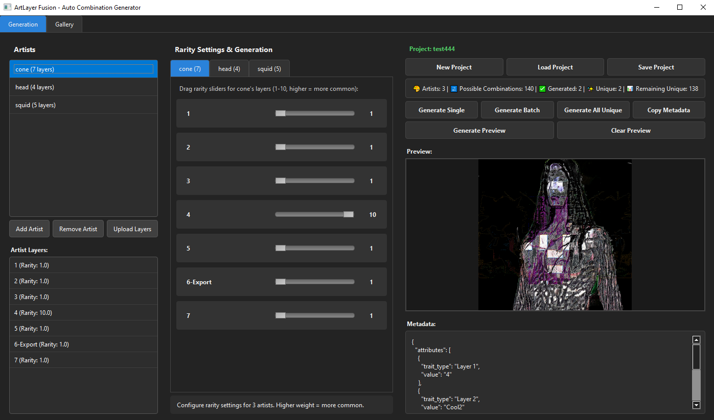

# gayy-nft-factory - NFT Generator



gayy-nft-factory is a user-friendly desktop application that lets you create unique NFT collections by combining layers from multiple artists. No coding required!

## 🚀 Quick Start Guide

### Step 1: Install Python
1. Download Python 3.8 or newer from [python.org](https://www.python.org/downloads/)
2. During installation, **make sure to check "Add Python to PATH"**
3. Complete the installation

### Step 2: Download the Project
1. Download all the project files to a folder on your computer
2. Keep all the files in their proper folder structure

### Step 3: Install Dependencies
1. Open Command Prompt (Windows) or Terminal (Mac/Linux)
2. Navigate to the project folder:
   ```bash
   cd path/to/gayy-nft-factory
   ```
3. Install required packages:
   ```bash
   pip install -r requirements.txt
   ```

### Step 4: Run the Application
```bash
python main.py
```

## 🎨 How to Create Your NFT Collection

### 1. Create a New Project
- Click **"New Project"**
- Select a folder where you want to save your project
- Enter a name for your collection (e.g., "Cyber Animals")

### 2. Add Artists
- Click **"Add Artist"** in the left panel
- Enter artist names (e.g., "Background Artist", "Character Artist", "Effects Artist")
- Each artist will manage their own set of layers

### 3. Upload Layers
- Select an artist from the list
- Click **"Upload Layers"** or drag & drop PNG files
- Each artist should upload their layers (e.g., different backgrounds, characters, effects)
- **Important**: Use transparent PNG files for best results

### 4. Set Rarity (Optional)
- Go to the Rarity tab for each artist
- Drag sliders to make some layers more common (higher numbers) or rarer (lower numbers)
- This controls how often each layer appears in your collection

### 5. Generate NFTs
- **Generate Single**: Create one random NFT to test
- **Generate Batch**: Create multiple NFTs at once
- **Generate All Unique**: Create every possible combination
- Watch the preview update in real-time!

### 6. View Your Collection
- Switch to the **"Gallery"** tab to see all generated NFTs
- Click on any NFT to see its details and metadata
- Copy metadata to clipboard for use on marketplaces

## 📁 File Structure
Your project will be organized like this:
```
Your_Project_Folder/
├── assets/
│   └── artists/
│       ├── Artist1/
│       │   ├── layer1.png
│       │   └── layer2.png
│       └── Artist2/
│           ├── effect1.png
│           └── effect2.png
├── workspace/
│   └── generated/
│       ├── 1.png
│       ├── 1.json
│       ├── 2.png
│       └── 2.json
└── config/
    └── project.json
```

## 🎯 Tips for Success

### Layer Preparation
- Use **transparent PNG files**
- Recommended size: **2000x2000 pixels**
- Name files clearly (e.g., "blue_background.png", "red_character.png")
- The app will automatically resize images to fit

### Collection Planning
- Start with 2-3 artists for testing
- Each artist should have 3-7 layers
- More layers = more possible combinations
- Test with small batches before generating thousands

### Example Workflow
1. **Background Artist**: 5 different background images
2. **Character Artist**: 4 character designs  
3. **Accessory Artist**: 3 hat/glasses options
4. **Total Combinations**: 5 × 4 × 3 = **60 unique NFTs**

## 🔧 Troubleshooting

### Common Issues

**App won't start:**
- Make sure Python is installed and added to PATH
- Check that all required packages are installed
- Verify all project files are in the correct folders

**Images not showing:**
- Use PNG format with transparency
- Check that image files aren't corrupted
- Ensure images have proper file extensions (.png)

**Generation errors:**
- Make sure at least one artist has layers uploaded
- Check that all layer files exist in the project folder
- Try generating a single NFT first to test

**Dark mode issues:**
- The app uses dark theme by default
- If text is hard to read, check your system's display settings

### Getting Help
If you encounter issues:
1. Check the error messages in the console
2. Verify all installation steps were followed
3. Ensure your image files are valid PNGs
4. Try creating a new project with test images

## 📊 Understanding the Statistics

- **Possible Combinations**: Total unique NFTs you can create
- **Generated**: How many NFTs you've made so far  
- **Unique**: How many are actually different combinations
- **Remaining Unique**: How many more unique NFTs you can create

## 🎉 What's Next?

After generating your collection:
1. Review all NFTs in the Gallery tab
2. Copy metadata for each NFT as needed
3. Use the numbered files for minting on platforms like Solana
4. Share your unique multi-artist creations!

---

**Happy NFT Creating!** 🎨✨

Remember: The power of this tool is combining multiple artists' work into unique digital collectibles. Collaborate, create, and have fun!